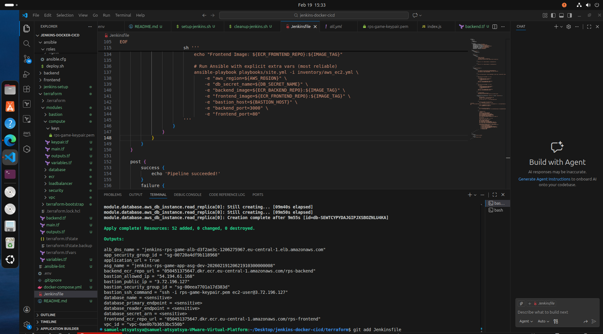
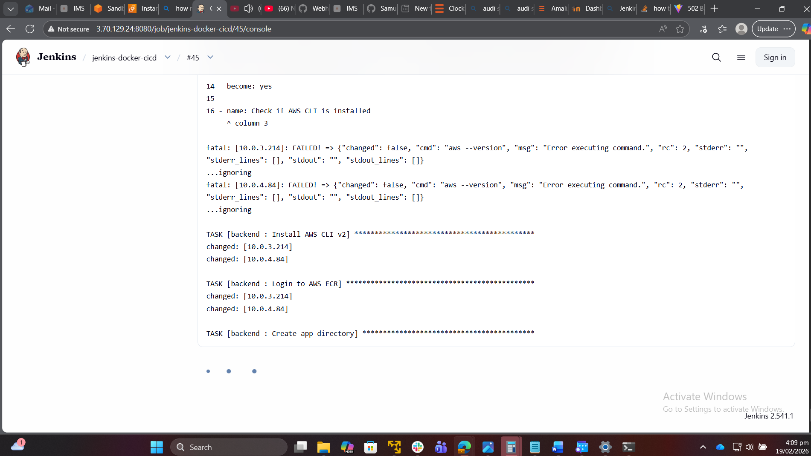
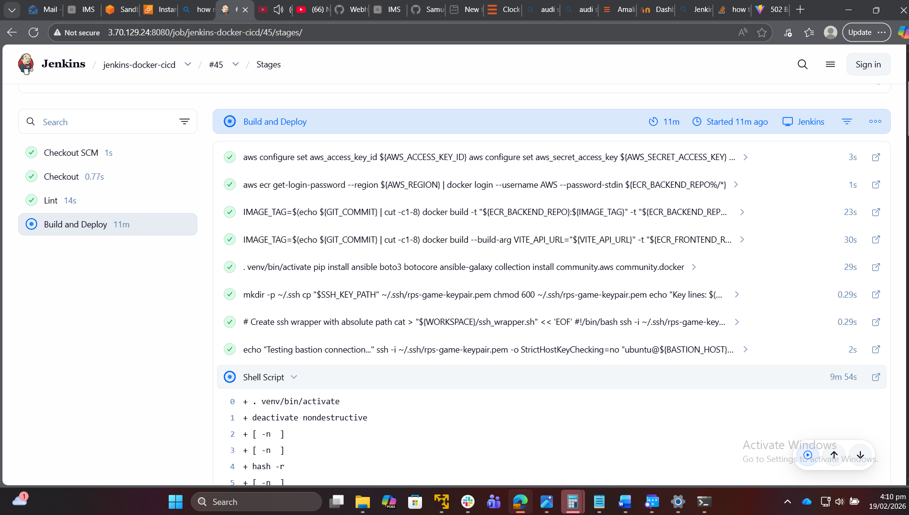
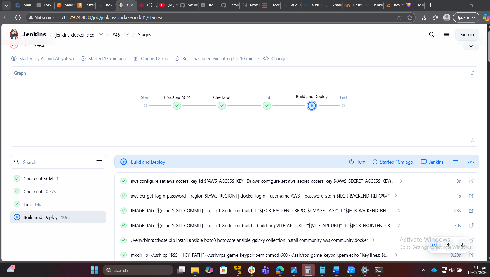

# Rock Paper Scissors Online - Full Stack Web App with Jenkins

A full-stack **Rock Paper Scissors** web application with **React frontend**, **Node.js + Express backend**, and **SQL database**. The project is designed with a **3-tier architecture** and uses modern DevOps tools including **Terraform**, **Ansible**, and **Docker** for infrastructure provisioning, configuration management, and containerization respectively.

---

## Table of Contents

- [Features](#features)  
- [Architecture](#architecture)  
- [Tech Stack](#tech-stack)  
- [Infrastructure Provisioning](#infrastructure-provisioning)  
- [Setup & Installation](#setup--installation)  
- [Usage](#usage)  
- [Future Improvements](#future-improvements)  

---

## Features

- **User accounts:** Each player has a username and persistent stats (wins, losses).  
- **Game logic:** Rock, Paper, Scissors with a computer opponent.  
- **Leaderboard:** Tracks top players based on wins.  
- **Score tracking:** Tracks wins, losses, and draws per session.  
- **Full-stack architecture:** React frontend, Express backend, SQL database.  
- **Containerized:** Docker used for both backend and frontend.  
- **Infrastructure as Code:** Terraform provisions 3-tier architecture.  
- **Configuration Management:** Ansible automates setup of servers and services.  

---

## Architecture

The app follows a **3-tier architecture**:

1. **Presentation Layer (Frontend)**  
   - React + Tailwind CSS  
   - User interacts with UI, submits game results, and views leaderboard.

2. **Application Layer (Backend)**  
   - Node.js + Express  
   - Handles API routes, game logic, and communicates with the database.

3. **Data Layer (Database)**  
   - SQL database hosted on AWS RDS (MySQL)  
   - Stores user accounts, game stats, and leaderboard data.

**Additional Infrastructure:**  
- **Docker:** Frontend and backend services containerized.  
- **Terraform:** Provisions EC2 instances, RDS, and networking components.  
- **Ansible:** Configures and deploys the app on the EC2 instances.  

---

## Tech Stack

**Frontend:**  
- React + Tailwind CSS  
- Vite as the build tool  

**Backend:**  
- Node.js + Express  
- Sequelize ORM for SQL database integration  

**Database:**  
- PostgreSQL or MySQL (RDS)  

**DevOps / Infrastructure:**  
- Terraform for 3-tier architecture provisioning (VPC, EC2, RDS, Security Groups)  
- Ansible for configuration management and deployment  
- Docker for containerizing services  

---

## Infrastructure Provisioning

- **Terraform:**  
  - Sets up the 3-tier architecture:  
    - Public Subnet → Load Balancer / Frontend  
    - Application Subnet → Backend API servers  
    - Private Subnet → RDS Database  
  - Configures security groups, networking, and dependencies.

- **Ansible:**  
  - Installs required packages (Node.js, Docker, Nginx, etc.)  
  - Deploys Docker containers for frontend and backend  
  - Ensures repeatable, automated deployment  

- **Docker:**  
  - Frontend container with React app  
  - Backend container with Node.js + Express  
  - Containers can be deployed individually or together using `docker-compose`  

---

## CI/CD Pipeline
**Pipeline Overview**
GitHub Push → Webhook → Jenkins → Lint → Build → Push to ECR → Deploy via Ansible → Application Running


**Jenkins Configuration**

Required Jenkins Credentials:

AWS_REGION - AWS region for resources
AWS_ACCESS_KEY_ID - AWS access key
AWS_SECRET_ACCESS_KEY - AWS secret key
ECR_BACKEND_REPO - ECR repository URL for backend
ECR_FRONTEND_REPO - ECR repository URL for frontend
DB_SECRET_NAME - AWS Secrets Manager secret name
BASTION_HOST - Bastion host IP address
VITE_API_URL - Frontend API endpoint
SSH_KEY_FILE - SSH private key for server access (file credential)

---

## Setup & Installation

### 1. Clone the repository

```bash
git clone https://github.com/yourusername/three-tier-rps-game.git
cd three-tier-rps-game
```

### 2. Backend Setup

```bash
cd backend
npm install
```

Configure config/db.js with your RDS credentials.

Start the backend server:

```bash
node server.js
# or for auto-reload:
npx nodemon server.js
```

### 3. Frontend Setup

```bash
cd frontend
npm install
npm run dev
```

Frontend should run on http://localhost:5173 by default.

### 4. Docker

Build backend:
```bash
docker build -t rps-backend ./backend
```

Build frontend:
```bash
docker build -t rps-frontend ./frontend
```

Run containers:
```bash
docker run -p 5000:5000 rps-backend
docker run -p 5173:5173 rps-frontend
```

### 5. Terraform (Infrastructure)
```bash
cd infra/terraform
terraform init
terraform plan
terraform apply
```

Provision EC2 instances, RDS, and networking for 3-tier architecture.

### 6. Ansible (Configuration & Deployment)
```bash
cd infra/ansible
ansible-playbook -i inventory.ini deploy.yml
```

Installs required packages and deploys Docker containers on the EC2 instances.
### 7. Jenkins Setup
Build custom Jenkins image:

```bash
cd jenkins
docker build -t jenkins-custom .
```


Run Jenkins:

```bash
docker run -d \
  --name jenkins \
  -p 8080:8080 \
  -p 50000:50000 \
  -v jenkins_home:/var/jenkins_home \
  -v /var/run/docker.sock:/var/run/docker.sock \
  --restart unless-stopped \
  jenkins-custom
```


Get initial admin password:

```bash
docker exec jenkins cat /var/jenkins_home/secrets/initialAdminPassword
```


Access Jenkins:
Navigate to http://your-jenkins-ip:8080
Enter initial admin password
Install suggested plugins
Create admin user

### 8. Configure Jenkins Credentials
Go to Manage Jenkins → Credentials → System → Global credentials

**Add each credential:**

- Click Add Credentials
- Kind: Secret text (or Secret file for SSH key)
- ID: Use exact names listed above
- Secret: Paste the value
- Click Create

**For SSH key:**

- Kind: Secret file
- File: Upload your .pem file
- ID: SSH_KEY_FILE

### 9. Create Jenkins Pipeline Job
New Item → Pipeline
Name: rps-game-pipeline
Build Triggers: Check "GitHub hook trigger for GITScm polling"

**Pipeline:**
- Definition: Pipeline script from SCM
- SCM: Git
- Repository URL: Your GitHub repo
- Credentials: Add GitHub credentials
- Branch: */dev or */staging
- Script Path: Jenkinsfile
- Save

### 10. Configure GitHub Webhook
Go to GitHub repository → Settings → Webhooks

**Click Add webhook**
- Payload URL: http://your-jenkins-ip:8080/github-webhook/
- Content type: application/json
- Events: Just the push event
- Active: checked
- Click Add webhook


### Usage

- Open the frontend in the browser (http://localhost:5173 or public EC2 URL).

- Enter a username and start playing Rock, Paper, Scissors.

- Scores are saved in the backend and persisted in RDS.

- View the leaderboard to see top players.


### Screenshots









## Future Improvements

- Add user authentication and JWT tokens

- Implement real-time multiplayer using WebSockets

- Track game history in a separate Games table

- CI/CD pipeline for automated deployments

- Add monitoring and logging for production servers

<p align="center">
  <sub>Made with ❤️ by Sam</sub>
</p>